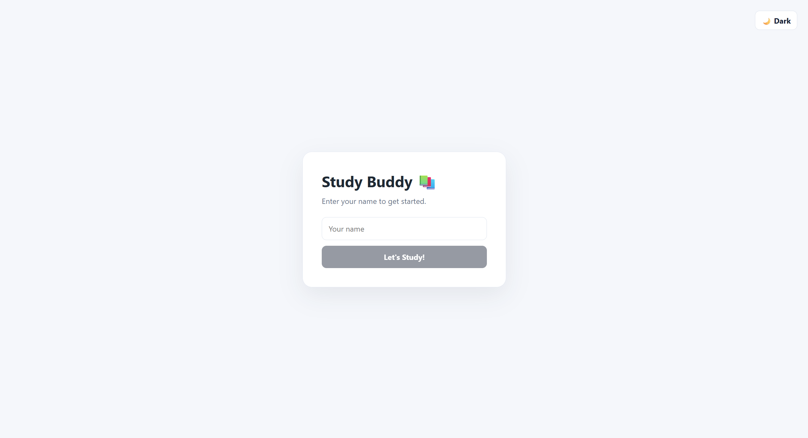
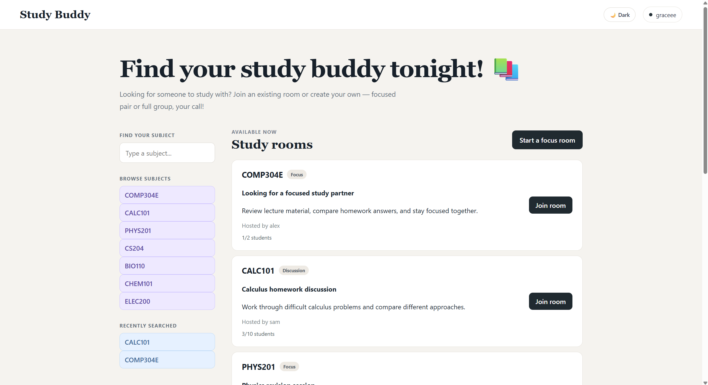
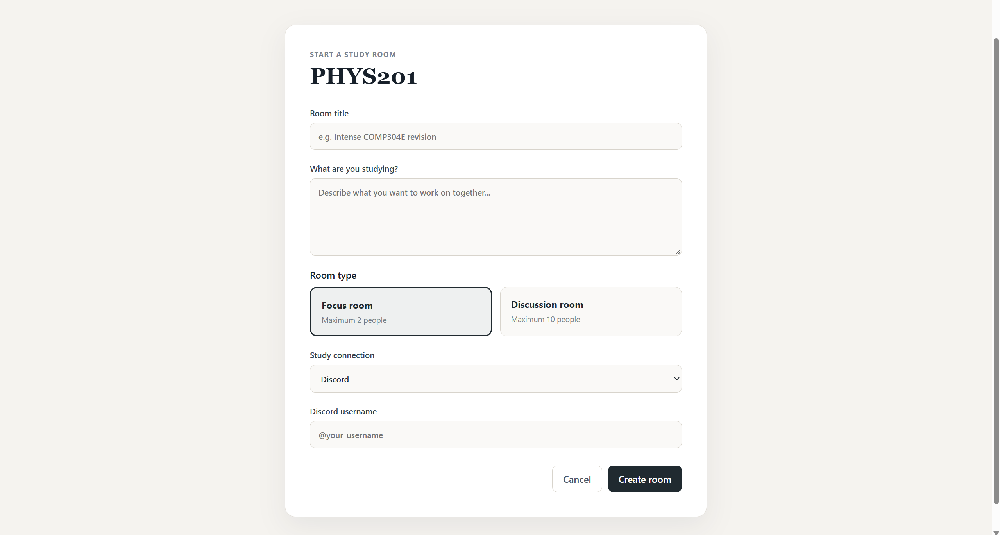
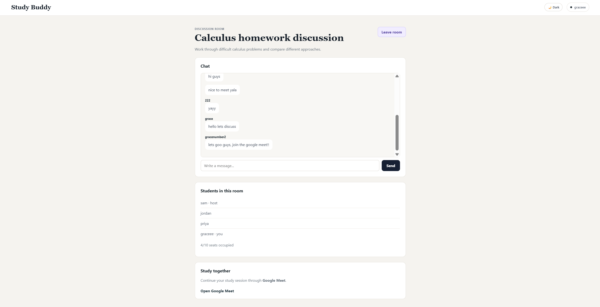
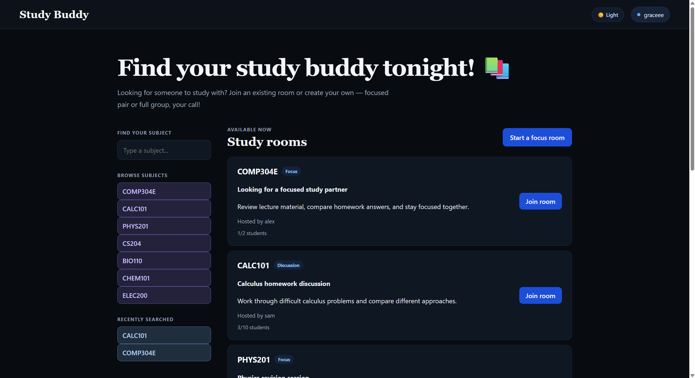

# Study Buddy 📚

## What is Study Buddy?

Study Buddy is a web app that helps students find other students to study with.

Students can search for a course, join an existing study room, or create their own room.

Each room can be either:

- A focused pair with a maximum of 2 students
- A discussion group with a maximum of 10 students

## Why did we make it?

Studying can be easier and more motivating when students have someone else to study with.

Study Buddy makes it simple to find people studying the same subject and start a study session together.

## Features

- Sign in with your name
- Search for courses
- Browse available study rooms
- Join other students' rooms
- Create your own study room
- Choose between Focus and Discussion rooms
- Room chat
- Leave a room
- Room hosts can delete their rooms
- Study connection links
- Light and dark mode
- Recently searched subjects

## Setup

Clone the repository and open the project folder.

Install the dependencies:

```bash
npm install
```

Start the development server:

```bash
npm run dev
```

Open the local address shown in the terminal.

## Architecture

Study Buddy is organized into separate folders for the user interface, application logic, data, testing, and documentation.

```text
studibudbud/
├── README.md
├── docs/
│   ├── architecture.md
│   └── decisions.md
├── src/
│   ├── ui/
│   │   ├── components/
│   │   │   ├── Header.jsx
│   │   │   ├── FinderRail.jsx
│   │   │   ├── RoomList.jsx
│   │   │   ├── RoomView.jsx
│   │   │   └── CreateRoomForm.jsx
│   │   └── styles/
│   │       └── index.css
│   ├── core/
│   │   ├── rooms.js
│   │   └── matching.js
│   ├── data/
│   │   └── mockRooms.js
│   └── main.jsx
├── tests/
└── assets/
```

### Folder Responsibilities

- `src/ui/` — Contains the React user interface and styling.
- `src/ui/components/` — Contains the main Study Buddy interface components.
- `src/ui/styles/` — Contains the application's CSS.
- `src/core/` — Contains the application's main logic, including room management and course matching.
- `src/data/` — Contains the study room data used by the application.
- `src/main.jsx` — Starts the React application.
- `docs/` — Contains additional project documentation.
- `tests/` — Used for application tests.
- `assets/` — Stores project images and other assets.

## Screenshots of Study Buddy Running

### Sign In Page



### Study Rooms Page



### Create a Study Room



### Study Room



### Dark Mode



## Technologies

- React
- JavaScript
- Vite
- CSS
- GitHub